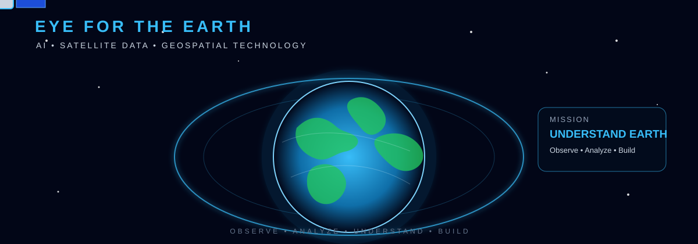

<div align="center">

# 👋 Hi, I'm Hanumathsai Rallabhandi

### 🛰️ AI & Full-Stack Developer | Building an Eye for the Earth 🌍

<p>
  
</p>



</div>

---

## 🌍 About Me

💻 B.Tech final-year student at **Vignan University**, focused on AI & Machine Learning and full-stack development.

🚀 Building with **Python, Flask, JavaScript, React, SQL and cloud technologies**.

🛰️ Exploring **satellite imagery, geospatial data and Earth observation**.

🎯 My long-term vision is to build **“Eye for the Earth”** — intelligent systems that can observe, analyze and understand our planet using AI and satellite data.

📫 **Email:** 231fa04239@gmail.com  
📷 **Instagram:** [@hanumathsai_rallabhandi](https://www.instagram.com/hanumathsai_rallabhandi)

---

## 🛰️ Eye for the Earth

> **Observe → Analyze → Understand → Build**

I want to combine **AI/ML + satellite data + geospatial technology + full-stack engineering** to create practical Earth-observation applications.

### 🔭 Areas I'm Exploring

- 🛰️ Satellite image visualization
- 🌍 Earth observation
- 🤖 AI-powered image analysis
- 🗺️ Geospatial intelligence
- 🌱 Land & vegetation monitoring
- 🔥 Change and disaster detection
- 📊 Interactive real-time dashboards

---

## 🛠️ Tech Stack

<p align="center">
  
</p>

---

## 🚀 Featured Projects

### 🛰️ Eye for the Earth
**AI + Satellite + Geospatial Platform**

An upcoming platform focused on satellite-data visualization, Earth monitoring, AI-powered analysis and interactive geospatial dashboards.

`Python` `AI/ML` `React` `Flask` `Satellite Data` `Geospatial`

### 🍔 Food Delivery Website
Full-stack food ordering application built with Flask, JavaScript and SQL.

### 🧾 Online Exam Portal
Student portal for authentication, marksheets and notifications.

### 🧮 Calculator
Simple and responsive calculator built with HTML, CSS and JavaScript.

---

## 📊 GitHub Stats

<div align="center">


<br><br>


</div>

---

## 🐍 Contribution Journey

<div align="center">


</div>

---

## 🎯 My Journey

```text
Web Development
       ↓
Python + Flask + JavaScript
       ↓
React + Databases + Cloud
       ↓
AI & Machine Learning
       ↓
Satellite & Geospatial Technology
       ↓
🛰️ EYE FOR THE EARTH 🌍
```

---

## ⚡ Philosophy

<div align="center">

### “Observe. Analyze. Understand. Build.”

**Code. Learn. Build. Repeat. 🚀**

</div>

---

<div align="center">

### 🛰️ Building technology that looks beyond the screen.

### 🌍 Building an **Eye for the Earth**.

<br>


</div>
